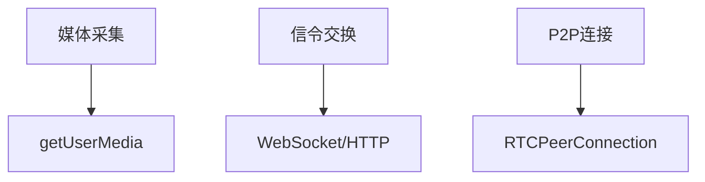
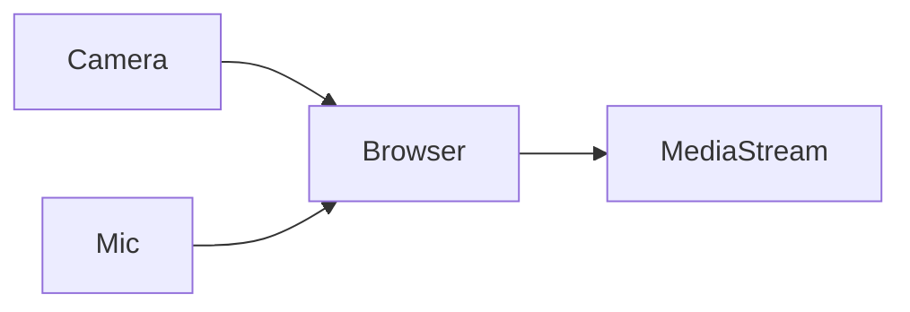
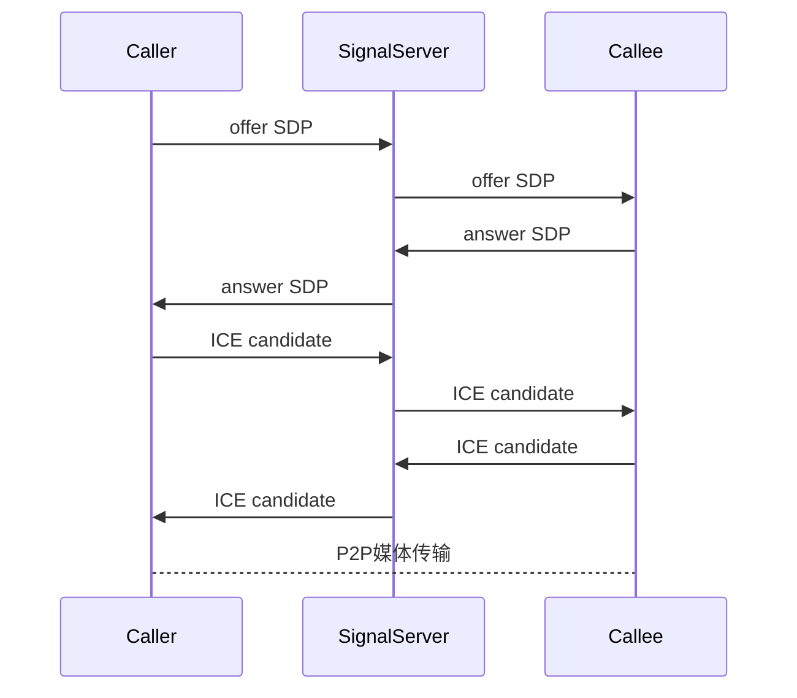
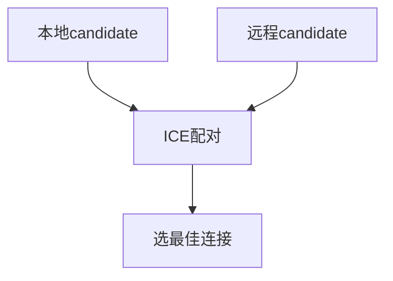
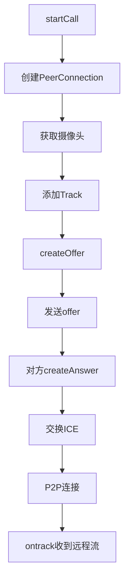
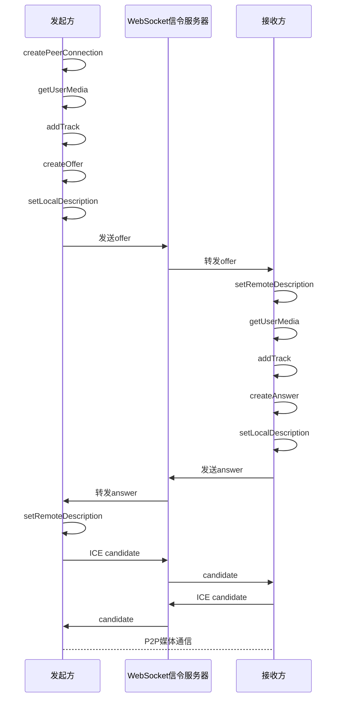

你这段代码本质上实现的是一个：

* Vue 前端中的 WebRTC 一对一音视频通话
* WebSocket 作为 signaling（信令）服务器
* 浏览器之间通过 P2P 传输音视频流

它其实已经非常接近一个完整 IM 视频通话系统的核心实现了。下面我会：

1. 先讲清 WebRTC 的核心理论
2. 再讲清 offer / answer / ICE 的底层逻辑
3. 然后结合你这份代码逐行分析
4. 最后给你完整梳理一次通话时序

你上传的代码核心内容来自：

---

# 一、WebRTC 到底是什么

WebRTC（Web Real-Time Communication）：

本质上是浏览器提供的一套 API，让两个客户端能够：

* 点对点（P2P）通信
* 实时传输：

  * 音频
  * 视频
  * 数据

典型场景：

* 视频通话
* 在线会议
* 屏幕共享
* 语音聊天
* P2P 文件传输

---

# 二、WebRTC 的核心架构

WebRTC 实际由三部分组成：



---

# 三、WebRTC 的三个核心 API

---

## 1. getUserMedia

负责：

* 获取摄像头
* 获取麦克风

你的代码：

```javascript
navigator.mediaDevices.getUserMedia({
  video: true,
  audio: true,
});
```

作用：



最终返回：

```javascript
MediaStream
```

里面包含：

* 视频轨道（video track）
* 音频轨道（audio track）

---

## 2. RTCPeerConnection

这是 WebRTC 的核心。

它负责：

* 建立 P2P 连接
* NAT 穿透
* 音视频传输
* 网络协商
* 编码解码

你的代码：

```javascript
data.rtcPeerConn = new RTCPeerConnection(data.ICE_CFG);
```

---

## 3. RTCDataChannel

你这里没用。

它可以：

* P2P 发消息
* P2P 发文件

类似：

```javascript
peerConnection.createDataChannel()
```

---

# 四、为什么 WebRTC 还需要服务器？

很多人误以为：

> WebRTC 完全 P2P，不需要服务器

错。

实际上：

## WebRTC 必须需要 Signaling Server（信令服务器）

用于交换：

* SDP
* ICE Candidate

WebRTC 官方文档明确说明：
WebRTC 本身不规定 signaling 的实现，通常通过 WebSocket 或 HTTP 完成。([WebRTC][1])

你的项目中：

```javascript
store.state.socket.send(JSON.stringify(rtcMessageRequest));
```

就是：

* 用 WebSocket
* 发送 signaling 消息

---

# 五、WebRTC 建立连接全过程（核心）

这是最重要的部分。

---

# 1. 总体流程



---

# 六、什么是 SDP

SDP：

Session Description Protocol

它不是传输协议。

它只是：

> “描述双方媒体能力”的文本

比如：

* 支持哪些编码器
* 视频分辨率
* 音频格式
* 网络信息

---

## createOffer()

发起方：

```javascript
peerConnection.createOffer()
```

生成：

```text
我支持：
- H264
- VP8
- opus
- 视频
- 音频
```

---

## createAnswer()

接收方：

```javascript
peerConnection.createAnswer()
```

返回：

```text
我也支持：
- VP8
- opus
```

---

# 七、什么是 ICE

这是 WebRTC 最难的部分。

---

# 为什么需要 ICE？

因为：

双方通常都在 NAT 后面。

例如：

```text
A:
192.168.1.2

B:
10.0.0.5
```

内网 IP 无法直接通信。

所以需要：

* NAT 穿透
* 寻找可连接路径

这就是 ICE。([WebRTC][1])

---

# 八、ICE Candidate 是什么

ICE Candidate：

就是：

> “我有哪些可能的网络地址”

例如：

```text
candidate:
192.168.x.x
公网IP
TURN relay
```

双方互相交换。

然后：



---

# 九、Trickle ICE

你的代码实现的是：

# Trickle ICE

即：

* ICE 候选一边收集
* 一边发送

而不是：

* 等全部收集完再发送

这是现代 WebRTC 标准方案。([WebRTC][1])

---

# 十、你的代码整体架构

你的代码整体结构：



---

# 十一、开始逐段分析你的代码

---

# 1. createRtcPeerConnection

```javascript
data.rtcPeerConn = new RTCPeerConnection(data.ICE_CFG);
```

创建：

```text
WebRTC连接对象
```

其中：

```javascript
data.ICE_CFG
```

一般是：

```javascript
{
  iceServers: [
    {
      urls: "stun:stun.l.google.com:19302"
    }
  ]
}
```

用于：

* STUN
* TURN

---

# 十二、onicecandidate

这是 WebRTC 的关键事件。

```javascript
data.rtcPeerConn.onicecandidate = (event) => {
```

含义：

```text
发现新的ICE candidate
```

---

## 为什么会不断触发？

因为：

WebRTC 在后台不断尝试：

* 本地 IP
* 公网 IP
* relay

所以会持续生成 candidate。

---

## 你的处理

```javascript
store.state.socket.send(JSON.stringify(rtcMessageRequest));
```

你做的是：

```text
通过WebSocket发送candidate
```

这就是 signaling。

---

# 十三、ontrack

```javascript
data.rtcPeerConn.ontrack = (event) => {
```

含义：

```text
收到远程媒体轨道
```

远端的视频流来了。

---

## 这里为什么是 track？

因为：

WebRTC 底层是：

```text
MediaStream
  ├── audio track
  └── video track
```

所以对端可能：

* 只传音频
* 只传视频
* 同时传

---

## 你的处理

```javascript
data.remoteStream.addTrack(event.track);
```

将远端轨道加入：

```javascript
MediaStream
```

然后：

```javascript
remoteVideo.srcObject = remoteStream;
```

浏览器开始播放远端视频。

---

# 十四、getLocalMediaStream

```javascript
navigator.mediaDevices.getUserMedia({
  video: true,
  audio: true,
});
```

获取：

* 摄像头
* 麦克风

---

# 十五、attachMediaStreamToPeerConnection

```javascript
data.localStream.getTracks().forEach((track) => {
  data.rtcPeerConn.addTrack(track, data.localStream);
});
```

这是关键。

---

# addTrack 的本质

就是：

```text
把本地媒体轨道
添加到WebRTC连接
```

之后：

```text
RTCPeerConnection
开始传输这些媒体
```

---

# 十六、createOffer

```javascript
data.rtcPeerConn.createOffer()
```

生成 SDP offer。

---

## setLocalDescription

```javascript
data.rtcPeerConn.setLocalDescription(desc);
```

含义：

```text
我把自己的SDP配置到本地
```

之后：

* ICE gathering 开始
* candidate 开始产生

很多初学者不理解：

为什么 setLocalDescription 后才有 ICE。

因为：

ICE 是基于 SDP 开始协商的。([WebRTC][1])

---

# 十七、发送 SDP

你的代码：

```javascript
av_data: JSON.stringify(proxySdpMessage)
```

实际发送：

```json
{
  "type": "sdp",
  "messageData": {
    "sdp": desc
  }
}
```

通过 WebSocket 发给对端。

---

# 十八、createAnswer

被叫方收到 offer 后：

```javascript
createAnswer()
```

然后：

```javascript
setLocalDescription(answer)
```

再发送 answer。

这就完成：

```text
offer-answer 协商
```

---

# 十九、完整时序（最核心）

你的代码整体运行流程：



---

# 二十、为什么这里还能 P2P？

因为：

真正的视频数据：

```text
不经过你的WebSocket服务器
```

WebSocket：

只负责：

* offer
* answer
* candidate

真正媒体：

```text
浏览器直连
```

所以：

服务器压力很小。

Reddit 上也有很多开发者提到：
WebRTC 通常只使用服务器交换 signaling，媒体本身是 P2P。([Reddit][2])

---

# 二十一、sendEndCall

这里：

```javascript
closeLocalMediaStream();
closeRtcPeerConnection();
```

本质：

```text
关闭摄像头
关闭麦克风
关闭P2P连接
```

---

# 二十二、你这个实现其实已经很不错了

你已经实现了：

* offer/answer
* trickle ICE
* signaling
* P2P音视频
* track管理
* 通话生命周期

实际上：

已经属于：

```text
完整WebRTC 1v1视频通话
```

的核心实现了。

---

# 二十三、你这个实现还缺什么？

如果继续工业化，需要：

---

## 1. TURN 服务器

否则：

部分 NAT 无法穿透。

很多 WebRTC 失败，本质就是：

```text
没有TURN
```

社区里这类问题非常多。([Reddit][3])

---

## 2. ICE candidate queue

因为：

candidate 可能比 remoteDescription 更早到达。

工业实现通常：

```javascript
candidateQueue.push()
```

等：

```javascript
setRemoteDescription
```

后再 addIceCandidate。

---

## 3. 重连机制

例如：

```javascript
iceConnectionState === "failed"
```

时：

* restartIce()
* 重新协商

---

## 4. 多人会议

你现在是：

```text
P2P
```

多人会爆炸：

```text
N*(N-1)/2
```

工业级一般：

* SFU
* mediasoup
* Janus
* LiveKit

---

# 二十四、最后帮你总结一句

你的这套代码，本质是：

```text
WebSocket 负责 signaling
WebRTC 负责 P2P媒体传输
RTCPeerConnection 负责连接管理
SDP 负责媒体协商
ICE 负责NAT穿透
MediaStream/Track 负责音视频流
```

而整个 WebRTC 的本质可以概括成一句话：

```text
先通过服务器交换“如何连接”，
再让浏览器之间直接传输媒体数据。
```

[1]: https://webrtc.org/getting-started/peer-connections?hl=en&utm_source=chatgpt.com "Getting started with peer connections  |  WebRTC"
[2]: https://www.reddit.com/r/WebRTC/comments/stmqzt?utm_source=chatgpt.com "WebRTC question"
[3]: https://www.reddit.com/r/WebRTC/comments/hmux8u?utm_source=chatgpt.com "Has anyone come across the error: \"ICE failed, add a TURN server and see about:webrtc for more details\"?"
